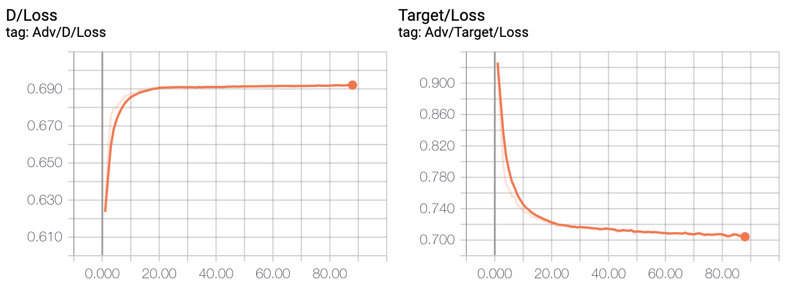
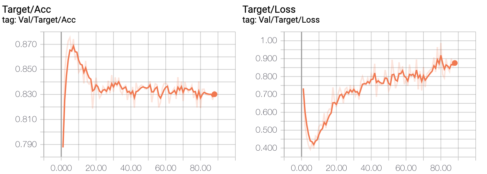

# ADDA.PyTorch
implement Adversarial Discriminative Domain Adapation in PyTorch


## Example
```
$ python train_source.py --logdir outputs
$ python main.py --logdir outputs --trained outputs/best_model.pt --slope 0.2
```


## Result
### SVHN -> MNIST
| | Paper | This Repro |
| --- | --- | --- |
| Source only | 0.601 | 0.659 |
| ADDA | 0.760 | ~0.83 |




## Resource
- https://arxiv.org/pdf/1702.05464.pdf
